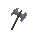
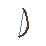

# Character Building

## Weapon Types

-  **Axe** — Pure crusher. High crush damage, zero defense. Best raw damage per hand for crush builds. Pair with a shield offhand if you want survivability, or dual-wield for maximum aggression.
-  **Shield** — Purely defensive. Massive defense on both damage types (35 crush / 38 pierce), negligible damage output. Always an offhand — never dual-wield shields (the contract forbids it). Frees your mainhand to be anything.
-  **Sword** — Balanced generalist. Modest pierce damage, some crush damage, good dex, and the only weapon with built-in crush defense. Works in almost any build.
-  **Spear** — Pierce specialist with a defensive edge. High pierce damage plus some pierce defense means spear-vs-spear matchups favor whoever has more armor. Slow dex (1) — don't count on agility.
-  **Bow** — Highest single-weapon damage in the game, all pierce. Forces you to leave the other hand empty, but that empty hand grants +18 DEX — so bow heroes are also the fastest heroes. Glass cannon: zero defenses.
-  **Unarmed** — Each empty hand gives +18 DEX, the highest of any item. Only effective if you can exploit weight differences. Going fully unarmed with light armor is a fringe dex build.

## Armor Types

-  **Leather** — Better against crush (6 def), lighter (weight 3). Keeps your dex strong. Best choice for agile or bow builds.
-  **Metal** — Better against pierce (8 def), heavier (weight 7). Tanks pierce damage but makes you a dex target. Best against bow and spear builds.

*Chest armor is 3× more impactful than helmet or greaves. Skirt is 2×. Always prioritize your chest slot.*

---

## Weapon Counters

| If you face... | They threaten... | Counter with... |
| --- | --- | --- |
| **Axe** | High crush | Leather armor + shield or spear |
| **Bow** | High pierce | Metal armor, close the gap with crush |
| **Spear** | Pierce + some def | Metal pierces back; leather stays light |
| **Sword** | Mixed damage | Stack the defense type they lean into |
| **Shield + anything** | Turtling | High dex build — weight exploits armor |

---

## Quick Build Guides

- **Berserker** — Axe mainhand, Axe offhand. Leather chest and skirt for crush resistance. Stay light. Play Aggressive every round. Melts heroes with no crush defense.
- **Tank** — Shield offhand, Sword or Spear mainhand. Full metal chest and skirt. Absorbs massive amounts of pierce damage. Play Defensive when under pressure, Neutral otherwise. Wins wars of attrition.
- **Sniper** — Bow (two-handed, other hand empty). No armor or leather only — weight kills your dex advantage. 42 pierce + 18 dex makes every round punishing. Fragile: one focused attacker will drop you fast.
- **Brawler** — Sword mainhand, Shield offhand. Mix of crush def (sword) + massive def (shield). Leather chest. Neutral/Defensive stance. A safer version of the berserker that can survive longer.
- **Dex Ghost** — Unarmed both hands or Bow build. Zero or minimal armor. Wins only if the enemy is heavy — full metal opponents are easy prey. Loses to other light builds.

---

## Battle Strategies

### Stance Play

Every round each hero picks a stance — this is your main decision point. Stances multiply the entire damage exchange, including damage you receive.

- **Aggressive** when you have the damage advantage and want the fight over fast. High risk — you take more damage too.
- **Defensive** when you're taking focused fire or your hero is low. Cuts all incoming damage significantly.
- **Neutral** is the safe default. Solid damage, moderate damage taken.

*The key: your defensive stance still protects you even against an aggressive attacker. Going defensive against an aggressor results in the same multiplier (10×) as two neutral heroes — but you sacrifice your own output.*

### Target Selection

You assign each of your 3 heroes a target each round. Dead heroes stop dealing damage, so:

- Focus fire one enemy hero to eliminate them quickly, evening the numbers.
- Spread fire if all enemies are equally threatening, but this is rarely optimal.
- Protect your key hero by anticipating enemy focus — put a shield or defensive build in the spot they'll hit hardest.

### The Commit-Reveal Edge

Your moves are hidden until P1 reveals — P2 sees P1's commit hash but not the moves. This means:

- As P2, commit after seeing P1 commit but you're effectively guessing their targets and stance. Mix your stances if unsure.
- As P1, you commit blind. If you suspect P2 will play Aggressive, a Defensive stance can neutralize their burst.

---

## Advanced: The Math

### Damage Formula

```math
damage = (
    (100 - enemy.crush_def) × attacker.crush_dmg
  + (100 - enemy.pierce_def) × attacker.pierce_dmg
  + (50 + enemy.weight - attacker.weight) × attacker.dex_bonus
) × (stance_mod(attacker) + stance_mod(defender))
```

Stance modifiers: **Aggressive = 8**, **Neutral = 5**, **Defensive = 2**.

A hero dies when their total accumulated damage reaches **100,000**.

### What This Means

Defense is a flat percentage off the damage pool before multipliers. 35 `crush_def` doesn't reduce by 35 points — it means the attacker's crush damage is multiplied by 65 instead of 100. Against a 17-crush axe, that's the difference between 1700 and 1105 crush contribution per exchange.

Dex scales with weight delta. The formula `50 + enemy.weight - your.weight` means:
- Equal weights → ×50 multiplier on dex
- Enemy has full metal (max ~42 weight) vs your naked hero (0) → ×92 multiplier
- You have full metal vs naked enemy → ×8 multiplier — your dex is nearly worthless

Stances are additive, not multiplicative. Both players' stance modifiers add together, then multiply the whole attack. Aggressive vs Aggressive (16×) deals 4× more damage than Defensive vs Defensive (4×) — the gap is enormous over multiple rounds.

## Full Stat Reference

### Weapons

| Weapon | Crush DMG | Pierce DMG | Crush DEF | Pierce DEF | DEX |
| --- | --- | --- | --- | --- | --- |
| **Unarmed** | 2 | 0 | 0 | 0 | 18 |
| **Axe** | 17 | 5 | 0 | 0 | 6 |
| **Shield** | 2 | 0 | 35 | 38 | 9 |
| **Sword** | 5 | 9 | 7 | 0 | 12 |
| **Spear** | 3 | 20 | 9 | 5 | 1 |
| **Bow (2H)** | 1 | 42 | 0 | 0 | 0 |

### Armor (per piece — multiply by slot)

| Armor | Crush DEF | Pierce DEF | Weight |
| --- | --- | --- | --- |
| **Nothing** | 0 | 0 | 0 |
| **Leather** | 6 | 3 | 3 |
| **Metal** | 4 | 8 | 7 |

*Slot multipliers: Chest ×3, Skirt ×2, Helmet ×1, Greaves ×1*

- **Full metal suit:** `crush_def` = (4 + 4×3 + 4×2 + 4) = **40**, `pierce_def` = **80**, `weight` = **42**
- **Full leather suit:** `crush_def` = (6 + 6×3 + 6×2 + 6) = **60**, `pierce_def` = **30**, `weight` = **18**